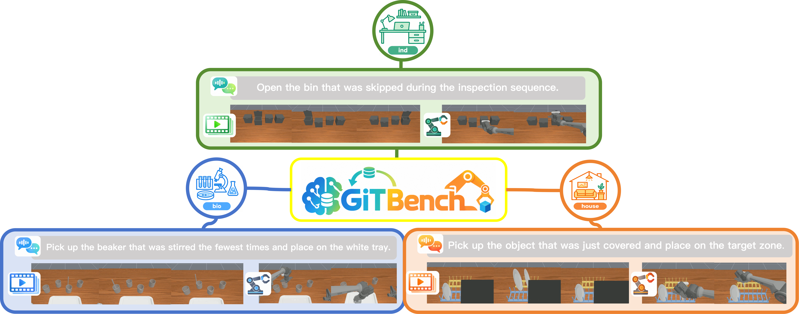

# GiTBench

> GiTBench ：a simulation benchmark for temporal grounding in robotic manipulation.

<p align="center">
  
</p>

<p align="center">
  <a href="https://kk-stephen.github.io/grounded-in-time/"></a>
  <a href="https://github.com/xgq2005/GiT"></a>
  <a href="<ARXIV_URL>"></a>
  <a href="https://huggingface.co/datasets/XGQ12345/GIT_hdf5"></a>
  <a href="https://www.modelscope.cn/datasets/xgq12345/GIT_hdf5"></a>
</p>

<p align="center">
  <a href="https://kk-stephen.github.io/grounded-in-time/">Website</a> ·
  <a href="https://github.com/xgq2005/GiTBench">GitHub</a> ·
  <a href="<ARXIV_URL>">arXiv</a> ·
  <a href="https://huggingface.co/datasets/XGQ12345/GiTBench_sim_train_lerobotv3">Hugging Face</a> ·
  <a href="https://www.modelscope.cn/datasets/xgq12345/GiTBench_sim_train_lerobotv3">ModelScope</a>
</p>

GiTBench is a simulation benchmark for temporal grounding in robot manipulation under perceptual ambiguity. The target object cannot always be identified from the current frame alone: several objects may look similar, while the instruction refers to an event in the episode history, such as the object filled last, the object placed first, or the object just handed over. Solving the task therefore requires using the demonstration and interaction history together with the current visual observation.

This repository packages the benchmark itself: its fixed simulator episodes, task manifest, local assets, evaluation scripts, and common policy interface. It contains nine simulation tasks and is designed to measure whether a policy can recover the temporally grounded reference and execute the corresponding manipulation.

## 🎯 Benchmark scope

The benchmark contains nine tasks:

- Laboratory: `bio2`, `bio4`, `bio5`
- Industrial: `ind2`, `ind3`, `ind5`
- Household: `house1`, `house3`, `house5`

Each task has 60 fixed test episodes, for 540 episodes total. The manifest divides them into `test-ID` (in-distribution), `test-CF` (counterfactual), and `test-OOD` (out-of-distribution) cases.

The repository includes the required assets and a vendored ManiSkill runtime. A separate simulator repository, external asset directory, or HDF5 dataset is not needed for benchmark evaluation.

## 🛠️ Install the benchmark environment

Use Python 3.10. Install a PyTorch build that matches your CUDA driver. The command below is an example for PyTorch 2.7 with CUDA 12.8; adjust the versions and index URL for your machine.

```bash
conda create -n gitbench python=3.10 -y
conda activate gitbench
python -m pip install --upgrade pip setuptools wheel

python -m pip install "torch==2.7.*" "torchvision==0.22.*" \
  --index-url https://download.pytorch.org/whl/cu128

# Run these commands from the GITBench repository root.
cd third_party/ManiSkill-3
python -m pip install -e .
cd ../..
python -m pip install -r requirements.txt
python -m pip install -e .
```

The local ManiSkill installation is required because GITBench imports the runtime from `third_party/ManiSkill-3`. The root requirements install the remaining benchmark dependencies. `opencv-python` and data-collection dependencies are not required for evaluation.

## 💨 Run a smoke evaluation

The reference `testpolicy` returns zero actions and checks the complete evaluation pipeline. It runs one episode for each configured task and writes results under `eval_results/`.

```bash
bash policy/testpolicy/evaluate.sh
```

Check the resolved command without starting the simulator:

```bash
bash policy/testpolicy/evaluate.sh --dry-run
```

## 🚀 Run evaluations directly

Use the built-in `zero` policy for a minimal direct run:

```bash
python scripts/eval_policy.py \
  --tasks bio2 --split test --episodes 1 \
  --policy zero --render-mode none
```

Run all nine tasks and all 540 test episodes without videos:

```bash
python scripts/eval_policy.py \
  --tasks bio2 bio4 bio5 ind2 ind3 ind5 house1 house3 house5 \
  --split test --policy zero --render-mode none \
  --no-stop-on-success
```

The `test` split selects the complete 60-episode set for each task. Use `--split test-ID`, `--split test-CF`, or `--split test-OOD` to evaluate one subset. Omit `--episodes` to run every episode in the selected split.

Common options:

- `--tasks`: one or more task keys;
- `--split`: `test`, `test-ID`, `test-CF`, or `test-OOD`;
- `--episodes`: per-task episode limit;
- `--start-episode`: offset within the selected split;
- `--max-steps`: override the task step limit;
- `--stop-on-success` / `--no-stop-on-success`: stop at success or continue to the step limit;
- `--resume` / `--no-resume`: reuse or ignore an existing log;
- `--save-video --video-dir eval_results/videos`: record videos;
- `--out` and `--summary-out`: choose log and summary paths.

The policy launcher reads `policy/testpolicy/eval_config.yaml`. Set `episodes: null` there to run every episode in the configured split. Its standard output directory is a timestamped subdirectory of `eval_results/` containing `log.json`, `summary.json`, the resolved configuration, and optional videos.

## 📊 Results and scoring

Each episode is classified as:

- `success`: the task goal is completed;
- `failure`: the goal is not completed, an incorrect interaction occurs, or the policy raises an exception;
- `error`: an evaluation infrastructure error, excluded from the formal success rate.

The primary metric is episode-level success rate. If success and failure occur on the same step, failure takes precedence.

Process completion is a supplementary `[0, 1]` metric based on weighted milestones such as contact, grasping, movement, and reaching a goal. It does not change the binary result. See `PROCESS_COMPLETION.md` for the milestone rules, dependencies, log fields, and aggregate metrics.

## 🧩 Custom policies

Add a package under `policy/` with a `make_policy(action_space)` factory. The returned object must implement `act(obs, info=None)` and may implement `reset(...)`. Use `policy/testpolicy` as the minimal template:

```text
policy/<policy_name>/
├── __init__.py       # exposes make_policy(action_space)
├── eval_config.yaml  # tasks, split, rendering, output, and resume settings
└── evaluate.sh       # evaluation entry point
```

For a standard launcher, copy the reference policy, update the `policy:` value in `eval_config.yaml`, and implement the policy factory. RDT, pi05, LeRobot pi05, and HAMLET have model-specific environments and dependencies; they are optional and are not needed for the built-in benchmark or reference policy.

## 📖 Citation

If you find this benchmark useful, please cite:

```bibtex
@article{groundedintime,
  title   = {Grounded in Time: Benchmarking Temporal Grounding under
             Perceptual Ambiguity in Robotic Manipulation},
  author  = {Yi Wang and Yang Yang and Guangqi Xu and Sumin Lin and Ning Kang and
             Pengxiang Lu and Xiaotong Chen and Zeyu Xue and Chenguang Yang and Zhenyu Lu},
  journal = {arXiv preprint arXiv:<ARXIV_ID>},
  year    = {2026}
}
```

## 🙏 Acknowledgments

We thank the ManiSkill-3 team for their open-source simulation platform and the work that makes this benchmark's manipulation environments possible.

## 📬 Contact

For questions, issues, or collaboration, please open an issue on the [GitHub repository](https://github.com/xgq2005/GiTBench).
